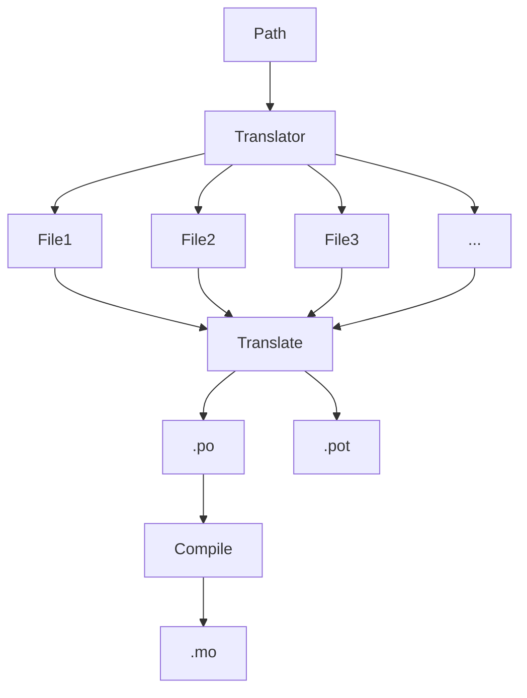

# py-auto-translate
Python Module to make translation files for all application python files 

### Usage
```bash
./translate.py -ll d -t -c -d com.domain
```


## Architecture

```mermaid
  graph TD;
    Path --> Translator;
    Translator --> File1;
    Translator --> File2;
    Translator --> File3;
    Translator --> ...;
    File1 --> Translate;
    File2 --> Translate;
    File3 --> Translate;
    ... --> Translate;
    Translate --> .po;
    Translate --> .pot;
    .po --> Compile;

    Compile --> .mo
    

```
